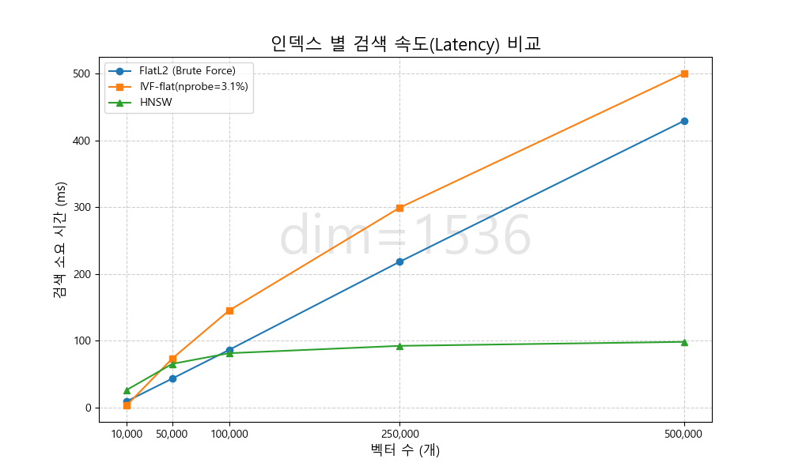
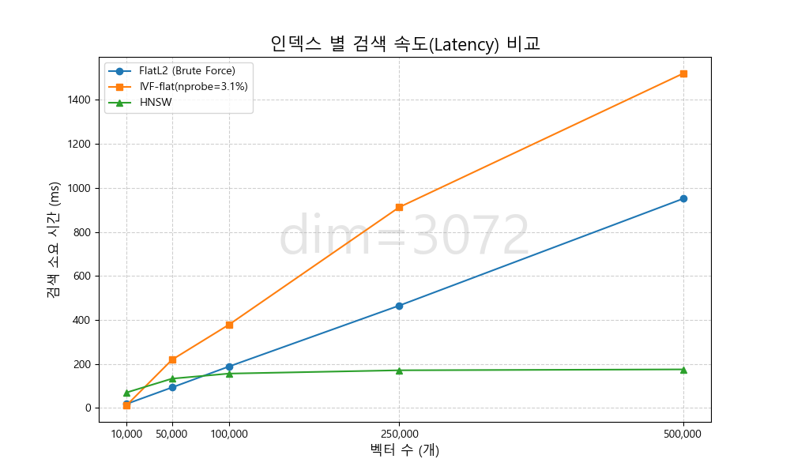
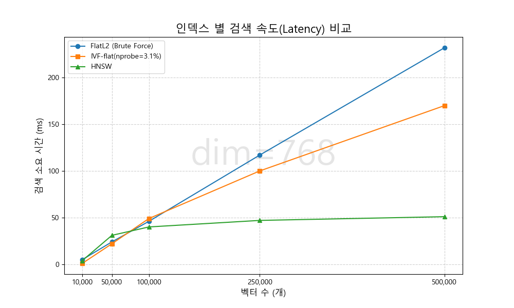
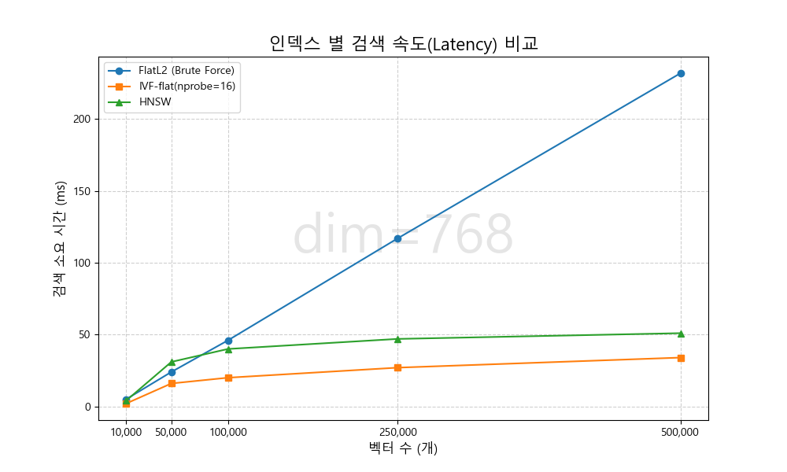
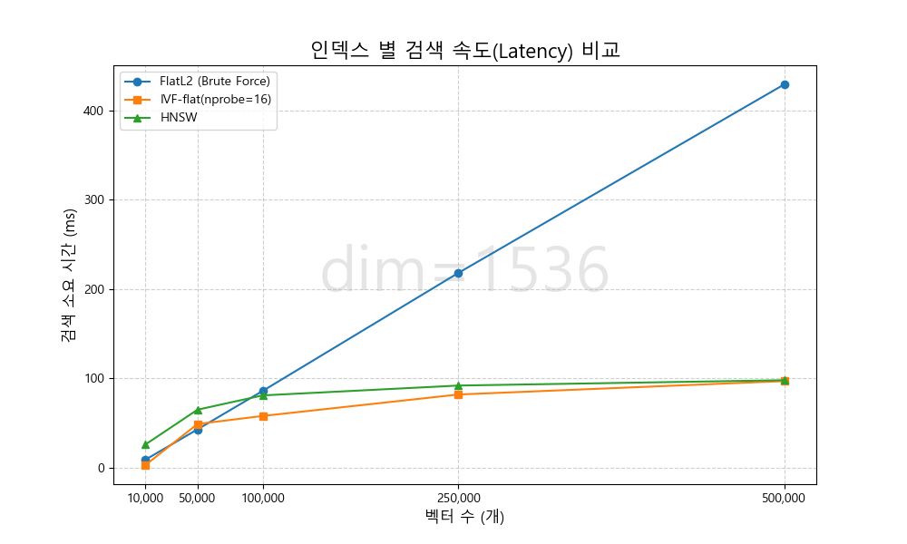
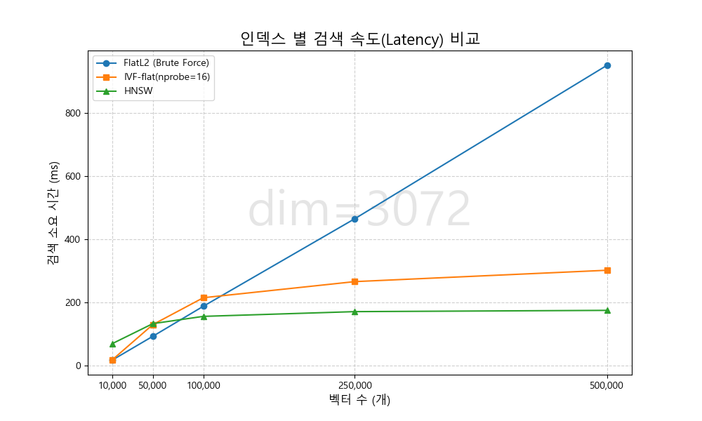

# 고차원 임베딩에서의 ANN 알고리즘 벤치마킹 및 선택 제안

**1. 개요**

“Garbage in, Garbage out(GIGO).” LLM을 위시한 AI가 아무리 발전하더라도, 양질의 입력 없이는 좋은 결과를 기대하기 어렵다. 이는 RAG 시스템의 성능이 LLM에게 제공되는 컨텍스트의 품질, 즉 Vector Search의 결과에 좌우되는 이유이다. 그러나 실시간 서비스 구현과 사용자 경험에 있어 지연 시간은 중요한 요소이며, 검색의 정확도와 지연 시간은 불가피한 트레이드 오프 관계에 있다.  

전통적인 KNN 방식은 전수 조사를 통해 정확도 100%의 결과를 내놓지만, 데이터 규모 증가에 따른 선형적인 탐색 시간 증가로 인해 대규모 시스템에는 적용하기 어렵다는 한계가 명확하다. 이에 대한 대안 ANN(Approximate Nearest Neighbor)은 ‘정확한’ 일치 대신 ‘충분한’ 일치를 통해 검색 효율을 극대화한다. 이를 통해 방대한 데이터 세트에서도 빠른 검색이 가능해진다. 본 글에서는 RAG에 사용되는 고차원 임베딩에서 현대 ANN 알고리즘의 성능을 벤치마킹하고, 실험 결과를 바탕으로 알고리즘 선택 기준을 제시한다.

**2. 이론적 배경**

**2.1. KD-Tree (K-Dimensional Tree)**

- 데이터 공간을 특정 차원을 기준으로 반복적으로 이진 분할(Binary Split)하여 트리 구조를 형성하는 방식이다.
- 저차원 데이터에서는 검색 속도가 매우 빠르지만, 차원이 높아질수록 공간이 희소해져 모든 노드를 방문해야 하는 등 효율이 급격히 저하된다. 이를 '차원의 저주(Curse of Dimensionality)'라고 하며, 고차원 벡터 검색에는 적합하지 않다.

**2.2. LSH (Locality Sensitive Hashing)**

- 유사한 데이터는 높은 확률로 같은 해시 값(Bucket)을 갖도록 설계된 특수한 해시 함수를 사용하는 방식이다.
- **동작:** 쿼리를 해시 함수에 넣은 후 일치하는 버킷의 데이터만 탐색한다.
- **장단점:** 데이터 양에 관계없이 검색 속도가 빠르다. 그러나 해시 함수의 확률적 특성으로 인해 정확도(Recall)의 편차가 크고, 경계선(Boundary)에 위치한 데이터가 누락될 가능성이 있다. 또한, 정확도를 높이기 위해 여러 개의 해시 테이블을 구성해야 하므로 메모리 사용량이 높은 편이다.

**2.3. IVF(Inverted File Index)**

- K-mean 클러스터링에 기반하여 벡터 공간을 분할하는 방식
- 동작
    - 전체 데이터를 nlist 개의 클러스터로 나누고, 각 클러스터의 중심점(Centroid)을 계산한다.
    - 쿼리가 들어오면 쿼리와 가장 가까운 nprobe 개의 Centroid를 찾는다(Coarse Search).
    - 해당 Centroid가 속한 클러스터들의 벡터들과 전수조사를 수행하여 가장 유사한 벡터들을 반환한다.
- 주요 파라미터
    - nlist : 생성할 클러스터(파티션)의 개수. nlist가 많아지면 더 많은 centroid와 비교하지만, 클러스터 내의 데이터 수는 줄어들어 검색 속도가 빨라진다.
    - nprobe : 비교 및 선정할 centroid 개수. 값이 클수록 최종적으로 전수 조사할 클러스터가 많아지므로 검색 속도가 느려지지만 검색 품질이 좋아진다.
    - quantizer : Centroid들을 저장하고 검색(Coarse Search)하는 인덱스. 주로 Flat 인덱스를 사용한다.

**2.4. HNSW(Hierarchical Navigable Small World)**

- Skip List와 Navigable Small World를 결합한 방법, 다층 그래프 구조.
- 구조
    - Layer 0 : 최하위 레이어로, 모든 벡터 데이터가 연결되어 있다.
    - Layer N : 최상위 레이어로, 소수의 벡터 데이터만 존재 및 연결되어있다.
    - 데이터 삽입 시, 확률적으로 몇 층에 위치할지 정해지며 Layer 0에 가까울수록 많은 벡터 데이터가 존재 및 연결되어있다.
- 동작
    - 쿼리가 들어오면, Layer N의 지정된 Entry Point에서 시작하여 쿼리 벡터와 가장 가까운 이웃 노드로 이동한다.
    - 더 이상 가까운 노드가 없으면 하강하며, 하위 층일수록 노드가 밀집되어 있으므로 정밀한 이동이 가능하다. 이를 Layer 0까지 반복하여 가장 유사한 벡터를 반환한다.
- 주요 파라미터
    - M : 각 노드가 동일 레이어에서 가장 가까운 노드들과 가질 연결의 수. Layer 0의 경우 정확도를 위해 2*M만큼의 연결을 가짐. 높을수록 메모리 사용량과 인덱싱/검색 속도가 증가한다.
    - ef(Exploration Factor) : 그래프 탐색 시, 쿼리 벡터와 가까운 노드 후보군을 담은 우선순위 큐의 사이즈.
    - efConstruction : 노드 삽입 시 연결될 노드를 결정하기 위해 사용되는 후보군의 크기. 값이 클 수록 더 많은 후보를 검토하므로 더 정확해지고 Clique(끼리끼리 뭉치는 현상)를 막고 다양성을 확보할 수 있다. 반면 삽입(인덱싱) 시간이 증가한다.
    - efSearch : 탐색 시 사용되는 잠재적인 후보군의 크기로, 높을 수록 Local Minima에 빠질 확률이 줄어 정확도가 높아진다. 반면 검색 시간이 증가한다.

**3. 실험 설계**

- **데이터셋:** Random Vectors
- 차원(d): 1536, 3072
- **변수(N):** 10k ~ 500k
- **환경:** CPU 환경 (Ryzen, 32GB RAM), Faiss-cpu, Numpy
- **평가 지표:** Latency
- 파라미터 설정: nq=100, nlist=4 x sqrt(N), nprobe=3.1%, M=32, efSearch=100

**4. 고차원 데이터에서의 초기 실험**
**4.1 실험 결과**

두 가지 차원(d = 1536, 3072) 환경에서 데이터 규모(N) 증가에 따른 알고리즘별 검색 성능을 측정하였다. 전체적인 경향성은 차원과 무관하게 유사하게 나타났으며, 구체적인 측정 결과는 다음과 같다.

<표1.> d=1536에서의 Latency 측정 결과표

| 벡터수 | FlatL2 | IVF-flat | HNSW |
| --- | --- | --- | --- |
| 10,000 | 9 ms | 3.01 ms | 26 ms |
| 50,000 | 43 ms | 73 ms | 65 ms |
| 100,000 | 86 ms | 145 ms | 81 ms |
| 250,000 | 218 ms | 299 ms | 92 ms |
| 500,000 | 429 ms | 500 ms | 98 ms |

<그림 1.> d=1536에서의 Latency 측정 결과 도표

<표 2.> d=3072에서의 Latency 측정 결과표

| 벡터수 | FlatL2 | IVF-flat | HNSW |
| --- | --- | --- | --- |
| 10,000 | 18 ms | 12 ms | 70 ms |
| 50,000 | 93 ms | 219 ms | 133 ms |
| 100,000 | 188 ms | 378 ms | 156 ms |
| 250,000 | 465 ms | 912 ms | 171 ms |
| 500,000 | 951 ms | 1520 ms | 175 ms |

<그림 2.> d=3072에서의 Latency 측정 결과 도표

4.1.1 FlatL2

- 벡터 수(N)가 증가함에 따라 검색 시간도 비례하여 선형적으로 증가하는 경향을 보였다.
- N = 50,000 구간까지는 HNSW보다 빠른 검색 성능을 보여주었으나, N = 100,000 구간에서는 HNSW와 유사한 성능을 보였다.

4.1.2. IVF-flat

- N = 10,000 구간에서는 3ms/12ms 로 세 알고리즘 중 가장 빨랐으나, N = 50,000 구간부터는 급격히 느려지며 가장 낮은 성능을 기록했다.

4.1.3. HNSW

- N = 10,000~50,000 구간에서는 FlatL2보다 느렸으나, N = 100,000 구간부터 FlatL2보다 빠른 성능을 보였다.
- 특히 벡터 수(N)가 증가하더라도 검색 시간의 증가폭은 매우 완만히 유지되었다.

4.2. 고찰 및 가설 설정

4.2.1. 고찰

- 데이터 차원(d)가 1536에서 3072로 증가함에 따라 전체적인 검색 시간은 증가하였으나, 알고리즘별 검색 성능 경향성은 일관되게 유지되었다.
- FlatL2는 인덱스 없이, 데이터 전체를 순회하는 O(N) 복잡도를 잘 반영하였다.
- HNSW는 벡터 수(N)가 적은 구간에서의 오버헤드를 제외하면 큰 구간에서의 O(log N)의 복잡도가 잘 반영되었다.
- 그러나 IVF-flat의 경우 N = 10,000인 구간을 제외한모든 구간에서 전수 조사 방식인 FlatL2보다 느린 성능을 기록하였다. 이는 대규모 데이터 환경에서 근사 탐색(ANN)이 전수 조사보다 빠를 것이라는 일반적인 기대와는 상충된다.

4.2.2 가설 설정

실험에서 IVF-flat이 FlatL2보다 느리게 측정된 원인에 대하여 다음과 같은 가설을 설정하였다.

- 가설 1 : 데이터의 특성과 비율적 nprobe
    - 데이터의 특성
        - 본 실험에서 사용한 데이터는 numpy의 random 모듈을 사용한 모의 데이터이므로, 벡터들이 공간상에 균등 분포할 것이라고 가정할 수 있다. 따라서 각 클러스터는 대체로 균등한 데이터 수를 가질 것이다.
        - 실제 문장 데이터는 의미를 기반으로 임베딩 되므로 각 클러스터가 갖는 데이터의 수가 균등치 않을 것이라고 추측한다.
    - 비율로 설정된 nprobe
        - 실험에서 nprobe는 nlist의 3.1%로 설정하였다. 이는 [Mlivus](https://milvus.io/docs/ko/performance_faq.md)에서 사용한 재현율 98%의 비율을 참고한 수치이다.
        - 데이터가 균등하게 분포됨을 가정한 상황에서, nlist의 3.1%로 설정된 nprobe는 전체 데이터의 3.1%를 검사하는 것을 의미한다.
        - N=500,000인 경우 약 15K 개의 데이터와 거리 계산을 수행한다.
        - ANN이 정확도를 일부 희생하여 속도를 얻는 기법임을 고려했을 때, 재현율 98%를 위한 비율을 채용하는 것은 맞지 않다고 사료된다.
    - 메모리 접근 패턴
        - FlatL2는 인덱스 없이 연속된 메모리 공간을 순차적으로 읽어들이므로 빠르다(높은 CPU 캐시 히트, SIMD 벡터 병렬 처리).
        - IVF-flat은 이 과정을 무작위 접근(Random Access)으로 수행한다.
    - 가설 1의 결론 : 따라서 3.1%에 대한 IVF-flat의 조사 비용이 FlatL2의 전수 조사 비용보다 크게 작용하여 대규모 데이터에서의 성능 저하를 유발했을 것으로 추측한다.
- 가설 2 : 초고차원의 임베딩
    - 실험에서 사용한 1536/3072 차원 데이터는 고용량 벡터이다. 이러한 데이터의 고차원 특성이 성능 저하의 원인이 되었을 가능성을 배제할 수 없다.

**5. 조건 최적화 및 재실험**

5.1 실험 조건 변경

- 차원 축소 : BERT나 일부 오픈 소스 모델에서 사용되는 d=768 환경 추가
- IVF-flat의 nprobe 최적화 : 기존 비율(3.1%)기반 설정을 16으로 고정([참고](https://www.emergentmind.com/topics/milvus-hnsw-ivf)).

5.2 재실험 내용 및 결과

5.2.1. 차원 축소(d=768, nprobe=3.1%(최적화 하지 않음))

<표 3.> d=768, nprobe=3.1%에서의 Latency 측정 결과표

| 벡터수 | FlatL2 | IVF-flat | HNSW |
| --- | --- | --- | --- |
| 10,000 | 5 ms | 1 ms | 4.01 ms |
| 50,000 | 24 ms | 22 ms | 31 ms |
| 100,000 | 46 ms | 49 ms | 40 ms |
| 250,000 | 117 ms | 100 ms | 47 ms |
| 500,000 | 232 ms | 170 ms | 51 ms |

<그림 3.> d=768, nprobe=3.1%에서의 Latency 측정 결과 도표

- FlatL2 : d = 768 환경에서는 N = 100,000일 때 FlatL2가 46ms를 기록했다. 이는 d = 1536(86ms) 대비 약 2배 빠른 속도로, 임베딩 차원이 낮을 수록 전수 조사(FlatL2)가 유효한 구간이 늘어남을 확인하였다.
- IVF-flat : 고차원(d ≥ 1536)과 달리, d = 768에서는 비율 기반 nprobe를 유지하더라도 N = 500,000 구간에서 FlatL2보다 빠른 성능을 보이며 인덱싱 효과가 일부 유지되었다.

5.2.2. nprobe 최적화(d = 768, nprobe = 16)

<표 4.> d=768, nprobe=16에서의 Latency 측정 결과표

| 벡터수 | FlatL2 | IVF-flat(3.1%) | HNSW | IVF-flat(16) |
| --- | --- | --- | --- | --- |
| 10,000 | 5 ms | 1 ms | 4.01 ms | 2 ms |
| 50,000 | 24 ms | 22 ms | 31 ms | 16 ms |
| 100,000 | 46 ms | 49 ms | 40 ms | 20 ms |
| 250,000 | 117 ms | 100 ms | 47 ms | 27 ms |
| 500,000 | 232 ms | 170 ms | 51 ms | 34 ms |

<그림 4.> d=768, nprobe=16에서의 Latency 측정 결과 도표

- 모든 구간에서 IVF-flat(16)이 FlatL2 및 HNSW를 제치고 가장 빠른 성능을 보였다.
- IVF-flat(16)에서 기존 비율 설정 대비 최대 5배 가량 속도가 향상되었다(170ms → 34ms).

5.2.3. nprobe 최적화(d = 1536, nprobe = 16)

<표 5.> d=1536, nprobe=16에서의 Latency 측정 결과표

| 벡터수 | FlatL2 | IVF-flat(3.1%) | HNSW | IVF-flat(16) |
| --- | --- | --- | --- | --- |
| 10,000 | 9 ms | 3.01 ms | 26 ms | 3 ms |
| 50,000 | 43 ms | 73 ms | 65 ms | 49 ms |
| 100,000 | 86 ms | 145 ms | 81 ms | 58 ms |
| 250,000 | 218 ms | 299 ms | 92 ms | 82 ms |
| 500,000 | 429 ms | 500 ms | 98 ms | 97 ms |

<그림 5.> d=1536, nprobe=16에서의 Latency 측정 결과 도표

- N = 50,000 구간을 제외한 전 구간에서 IVF-flat이 가장 빠른 성능을 보였다.
- nprobe가 비율로 설정된 IVF-flat보다 최대 5배(500ms → 97ms) 단축되며, 대규모 데이터에서도 안정된 검색 속도를 확보했다.

5.2.4. nprobe 최적화(d = 3072, nprobe = 16)

<표 6.> d=3072, nprobe=16에서의 Latency 측정 결과표

| 벡터수 | FlatL2 | IVF-flat(3.1%) | HNSW | IVF-flat(16) |
| --- | --- | --- | --- | --- |
| 10,000 | 18 ms | 12 ms | 70 ms | 19 ms |
| 50,000 | 93 ms | 219 ms | 133 ms | 130 ms |
| 100,000 | 188 ms | 378 ms | 156 ms | 215 ms |
| 250,000 | 465 ms | 912 ms | 171 ms | 266 ms |
| 500,000 | 951 ms | 1520 ms | 175 ms | 302 ms |

<그림 6.> d=1536, nprobe=16에서의 Latency 측정 결과 도표

- N = 100,000 구간에서 일시적으로 성능이 저하되었으나, N = 250,000 이상 구간에서는 다시 FlatL2보다 빠른 성능을 보였다.
- nprobe가 비율로 설정된 IVF-flat보다 최대 5배(1520ms → 302ms)의 성능 향상을 보였다.

5.3. 추가 실험 고찰

- 4장의 실험에서 확인하였던, 데이터 차원(d)의 증가에 따른 전체 검색 시간의 증가를 768 차원에서도 확인할 수 있었다.
- nprobe를 16으로 고정함에 따라 IVF-flat의 검색 속도가 최대 5배 향상 및 대규모 환경에서 FlatL2보다 느린 현상이 해결되었다. 이는 4.2절 가설1에서 언급한 대로 과도한 nprobe 설정으로 인한 비효율적인 비교 연산과 메모리 접근 비용이, 전체 데이터에 대한 순차적 전수 조사(FlatL2)보다 큰 오버헤드로 작용했음을 의미한다.
- IVF-flat(16)은 d=768과 d=1536에서 HNSW보다 더 빠른 성능을 보였으나, 초고차원인 d=3072일 때는 HNSW보다 느린 성능을 보인다. 이는 차원이 증가할수록 클러스터 내의 거리 계산 비용이 급증하기 때문으로 추정된다.
- HNSW는 d = 3072, N = 500,000의 환경에서도 175ms라는 안정적인 성능을 유지했다. 데이터의 차원과 개수가 급격히 증가하더라도 성능 저하가 거의 없는 확장성을 증명하였다.

**6. 종합 논의 및 결론**

6.1 요약

본 연구는 RAG 시스템 개발 과정에서 관성적으로 사용되던 벡터 스토어의 검색 알고리즘 및 설정에 대해 재고하고, 실제 데이터 규모(N)와 차원(d)의 변화가 검색 성능(Latency)에 미치는 영향을 정량적으로 분석하고자 수행되었다. 특히 일반적으로 자주 사용되는 OpenAI 임베딩 모델의 차원(1536/3072) 환경에서 각 알고리즘의 임계점과 최신 알고리즘(HNSW)의 효용성을 검증하는 데에 목적을 두었다.

본 연구의 결과 해석 시 고려해야 할 한계점은 다음과 같다.

- 데이터 분포의 특성: numpy.random을 이용한 생성 데이터는 공간상에 균등 분포하므로, 실제 의미 기반 문장 임베딩의 분포를 완벽히 반영하지 못할 수 있다.
- 정확도(Recall) 배제: 검색 속도 최적화에 집중하였기에, 파라미터 변경에 따른 검색 정확도(Recall) 변화는 평가 지표에서 제외되었다. ANN에서 일반적으로 검색 속도와 검색 정확도의 관계는 트레이드-오프 관계이다.
- 휴리스틱 파라미터 설정: 실험에서 사용된 nprobe 값은 Grid Search 등을 통한 선정이 아닌 선행 문헌에 의존하여 설정되었다.

4장(초기 실험)에서는 OpenAI의 임베딩 환경(d = 1536/3072)에 대하여 FlatL2, IVF-flat, HNSW의 검색 속도를 비교하였다. FlatL2는 O(N), HNSW는 대규모 환경에서 O(log N)의 복잡도를 잘 반영하였다. 그러나 IVF-flat은 N ≥ 50,000 구간부터 FlatL2보다 느린 성능 역전 현상을 보였다. 분석 결과 비율로 설정된 nprobe와 고차원 데이터의 연산 비용이 원인인 것으로 파악되었다.

5장(추가 실험)에서는 d = 768 환경 추가 및 nprobe = 16 고정 후 추가 실험을 진행하였다. 그 결과 IVF-flat의 성능 저하 문제를 해결하고 최대 5배의 속도 향상을 확인하였다. 또한 저차원 데이터에서는 FlatL2의 유효 구간이 넓어지는 것을 확인할 수 있었으며, IVF-flat의 경우 임베딩 차원에 민감함을 확인하였다. 반면 HNSW는 차원과 규모의 변화에도 견고한 성능을 유지함을 입증하였다.

6.2. 알고리즘 선택 가이드라인

실험에 따라 다음의 선택 가이드라인을 제안한다.

| 데이터 규모(N) | 임베딩 차원(d) | 우선 순위 / 제약 사항 | 추천 알고리즘 | 비고 |
| --- | --- | --- | --- | --- |
| 소규모(≤ 100K) | 전 구간(768~3072) | 정확도 최우선 | FlatL2 | - 정확도 100%  - 속도 저하 미미 |
| 대규모(> 100K) | 고차원(≥ 1536) | 속도 및 정확도 | HNSW | - 높은 정확도 |
| 대규모(> 100K) | 저/중차원(≤ 768) | 검색 속도 최우선 | IVF-flat | - 적절한 nprobe 튜닝 필요 |
| 대규모(> 100K) | 전 구간 | 메모리 부족(제약) | IVF-flat | - 적절한 nprobe 튜닝 필요 |

6.3. 결론 및 제안

일반적으로 FlatL2는 전수 조사를 통해 100%의 정확도(Recall)을 보장하는 반면, IVF 계열은 파라미터 튜닝을 통해 90~95% 수준의 정확도를 목표로 하는 근사 탐색 방식이다. HNSW는 근사 탐색임에도 불구하고 FlatL2에 준하는 높은 정확도를 보이는 것으로 알려져 있다. 현대 RAG(Retrieval-Augmented Generation) 시스템에서 가장 중요한 원칙 중 하나는 GIGO(Garbage In, Garbage Out)이다. 아무리 뛰어난 LLM을 사용하더라도, 부정확한 정보가 입력된다면 최종 답변의 품질을 보장할 수 없다. 이러한 원칙과 실험의 결과를 종합하여 다음과 같은 선택 기준을 최종 제안한다.

- 소규모 데이터(≤ 100K): 속도 차이가 미미하므로, 100% 정확도를 보장하는 FlatL2를 사용하는 것이 가장 이상적이다.
- 대규모 데이터(≥ 100K) 및 일반적인 환경: 검색 속도와 정확도 밸런스가 가장 뛰어난 HNSW를 사용한다.
- 제한적인 리소스 환경 & 초대규모 데이터: 하드웨어 메모리 제약 등으로 인해 HNSW의 사용이 불가능한 경우, IVF 계열을 채택하며, 반드시 Re-Ranker와 조합하여 사용한다.

**7. 참고 문헌**

[1] https://milvus.io/ko/blog/understanding-ivf-vector-index-how-It-works-and-when-to-choose-it-over-hnsw.md

[2] https://www.pinecone.io/learn/series/faiss/hnsw/

[3] https://milvus.io/docs/ko/performance_faq.md

[4] https://www.emergentmind.com/topics/milvus-hnsw-ivf

[5] https://www.elastic.co/search-labs/blog/hnsw-graph
